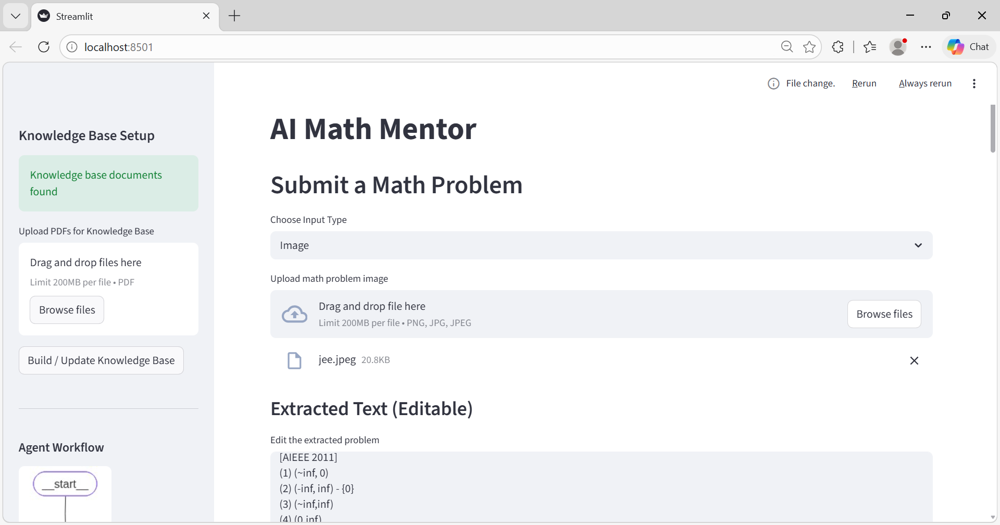
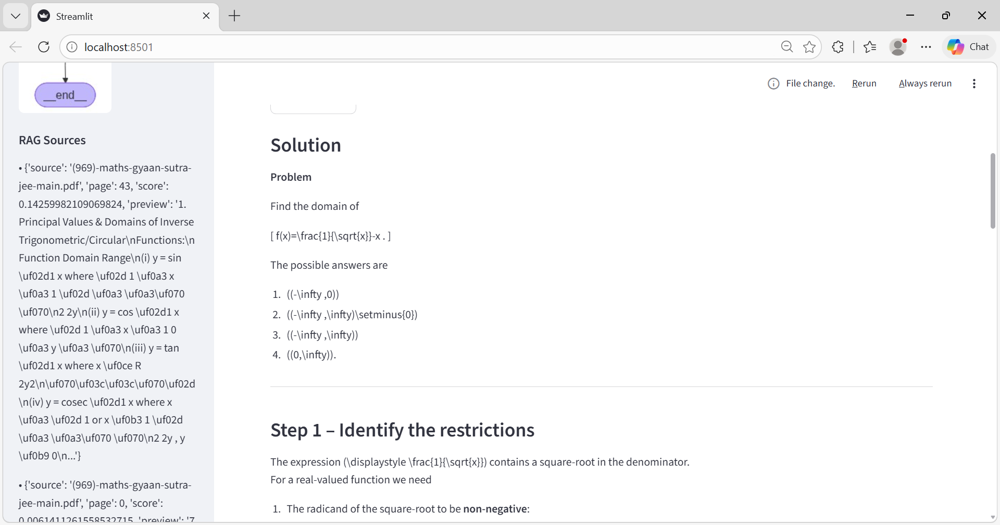
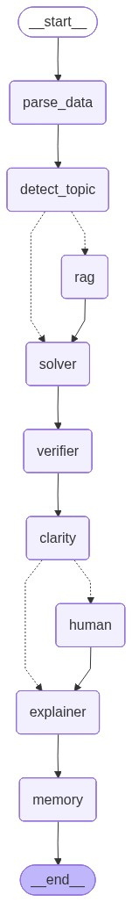

### Welcome to **Math-Agent** solver using Exrtaction + Agentic AI + RAG

Math Agent is the end-to-end math solver using Agentic AI workflows and RAG retrieval techniques with some extraction methods.

### Workflow

<p align="center">
  
  
</p>

<p align="center">
  
</p>

```
1. multimodal(text, image, docs, Audio) 
    * text   - input text-bar
    * images - EasyOCR [png, jpeg]
    * docs   - PymuPDF [doc, PDF]
    * Audio  - ElevenLabs


                        'Agent-1' 
            Parser Agent (Converts raw input → structured problem)
2. Parse the data into Structured Json
    

                        'Agent-2'    
            Intent Router Agent (Classifies problem type and routes workflow)


                        'Agent-3'
            Solver Agent (Solves using RAG + optional tools (e.g. python calculator))
                RAG + KB(math formulas etc) or direct Solver


                        'Agent-4'
                 Verifier / Critic Agent 
                        Checks: 
                        * correctness 
                        * units & domain 
                        * edge cases 
                        Triggers HITL if unsure 

                    'Agent-5'
                Explainer / Tutor Agent 
                Produces step-by-step, student-friendly explanation 

4. Self learning Agent + Memory

5. Deployment
```

### Optimized
1. skiped the HITL for parsing, and showed the extracted text before passing to the agent. reduces the unwanted llm calls and agent in the loop.

2. dinamic rag that updates the its knowledge base with good chunking strategery. This stores the small chunks of  embeddings that are good for formulas. you can see the formulas in the **(969)-maths-gyaan-sutra-jee-main.pdf**

---

### Issues 
There is still need more optimization for this project to work efficieltly.
#### Handling the Latex formating
1. need to handle the Latex to show them in the streamlit app.
why it can't done now: Because, unlike the LLM models they have separate Normalization pipline to handle the Latex and other formatting structures.
    ex: ChatGPT Uses a Dedicated Math Renderer (KaTeX/MathJax)

**What the Streamlit can do:**
Here, we are getting the response form chatGroq with mixed results like Text + Latex. And Streamlit is light wight framework to display the limited funtionalities. 

We can add this Normalized layer by separating the latex from the text and printing it at designated places when required. And this a separate task that takes time as of now.

#### Tool calling
2. Mentioned the other tools in the Assignment we can create a limitted tools to handle the alzebric problems, this need a deeper programming to make work this tools 

add, sub, mul, etc.. we can create this type of tools and can route our workflow, but for the JEE style programmes wee need to attach to the other exteral tools to solve this kind of differencition, calculaus, and other complex problems.

---

### how to use this in you local PC:

Set up intructions

```
#s1: get the repo from git:

git clone https://github.com/praveensunkara19/mathAgent.git

cd mathAgent

#s2: set the conda environment

conda create -n mathagent python=3.13

conda activate mathagent

# after activating the environment install all the requirements
#s3:
pip install requirements.txt

Before running the app you need to get the Groq and ElevenLabs API keys
groq platform: https://console.groq.com/keys
ElevenLabs   : https://elevenlabs.io/app/developers/api-keys

s4: create a file .env in the mathAgent

GROQ_API_KEY = YOUR_API_KEYS
ELEVENLABS_API_KEY = YOUR_API_KEYS

s5: run the app
# run the app in streamlit
# streamlit run main.py

```
# Acknowledgements

All thanks to open source contributers of **Langraph** for their detailed documentation.
* few of the code is modified by the GPTs. Thanks to them tooo!... 

---

With love praveensunkara19

I Appriciate anyone can modify and edit and update to add features  to this repooo!.
